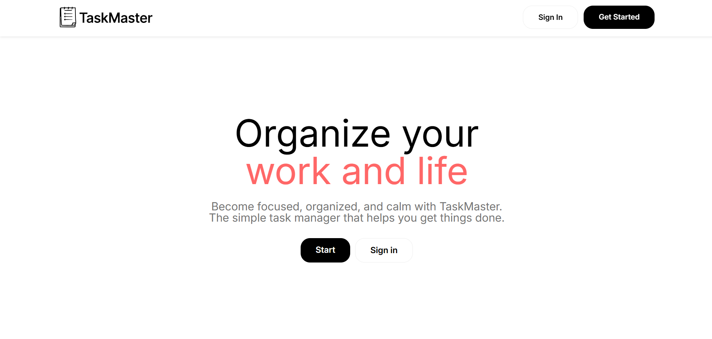
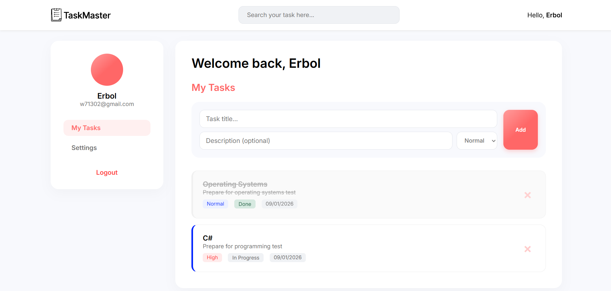
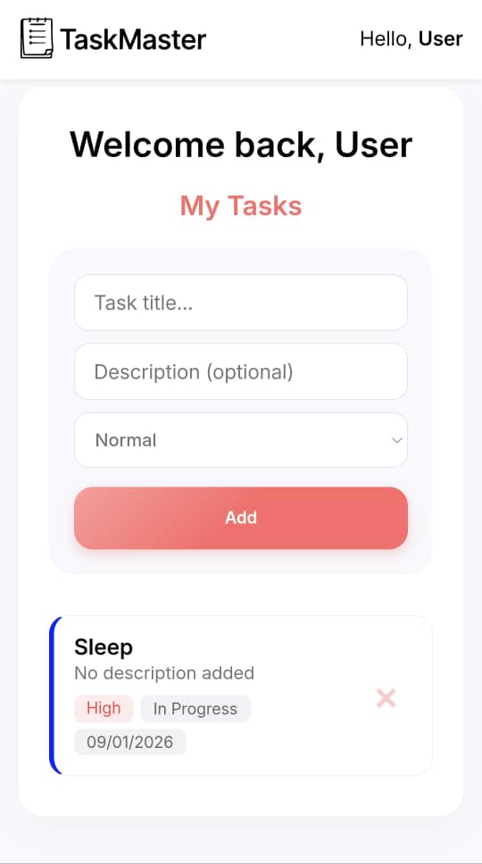

# TaskMaster - Personal Task Manager

**TaskMaster** is a modern, responsive Single Page Application (SPA) designed to help users organize their daily tasks efficiently. Built with Vanilla JavaScript, it features a clean UI, real-time search, and local data persistence.

---

## Live Demo

Check out the live version of the project here:
**[https://erbolshermamatov.github.io/uitm_project]**

---

## Features

- **Authentication System**: Secure Login and Registration forms with validation.
- **Task Management**:
  - Create new tasks with Title, Description, and Priority.
  - Mark tasks as **Done** / **In Progress**.
  - Delete unwanted tasks.
- **Smart Search**: Real-time filtering of tasks by title or description.
- **Priorities**: Visual indicators for **High**, **Normal**, and **Low** priority tasks.
- **Data Persistence**: Uses `localStorage` to save your data (no backend required).
- **Fully Responsive**: Optimized for Desktops, Tablets, and Mobile devices.
- **Settings**: User profile management (Change Name, Delete Account).

---

## Technology Stack

The project was built using a pure frontend stack without external frameworks:

- **HTML5**: Semantic structure.
- **CSS3**: Flexbox, Grid, CSS Variables, Media Queries.
- **JavaScript (ES6+)**: Modular architecture (`dashboard.js`, `ui.js`), DOM manipulation.
- **Local Storage**: Client-side database.

---

## Screenshots

### 1. Landing Page

### 2. Dashboard & Tasks

### 3. Mobile View & Search

